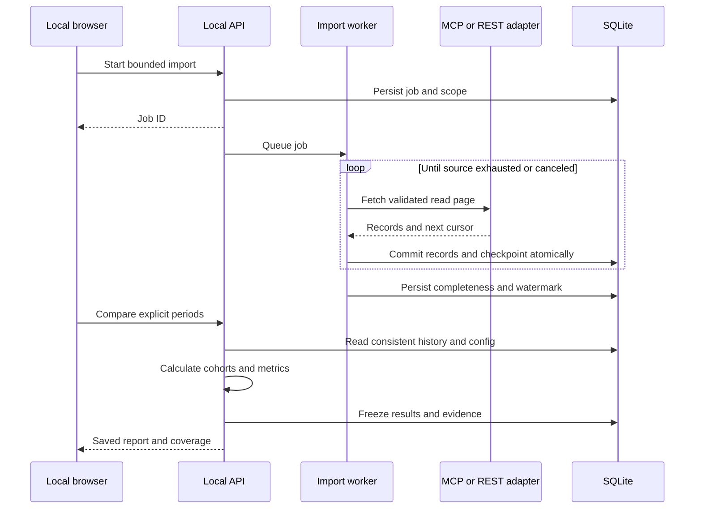

## Context

See proposal.md for motivation and scope. The user confirmed a local single-user Node.js/TypeScript application with SQLite, on-premise Jira/Bitbucket, MCP-first access, and read-only REST fallback. Application development uses Node.js and Java in the user's organization; Python is primarily used for MLOps. The confirmed architecture follows application-team ownership. Exact source versions, MCP schemas, credentials, and adoption dates have not been supplied; setup verifies these rather than inventing them.

The project root and planning home are `/Users/peter/work/ai-productivity`. Keep transport, service, metrics, and persistence responsibilities separate within this application. The existing Git repository contains the project documentation; application implementation is pending.

## Goals / Non-Goals

Provide deterministic, explainable comparisons with bounded imports, explicit missingness, and reproducible evidence. Keep calculations local and source integrations read-only. Do not implement a universal arbitrary-tool agent, causal inference engine, employee scoring system, or cloud service. Statistical confidence intervals, standardized work-mix adjustment, deployment metrics, vendor telemetry, and measured effort/cost models are deferred; descriptive stratification is included now.

## Decisions

### Runtime and placement

Use a supported Node.js LTS release with TypeScript in strict mode, a lightweight HTTP framework, and SQLite through a compatible driver. Prefer the application team's established framework when identified during apply; otherwise use Express as the minimal default. Use the official TypeScript MCP SDK and a backend HTTP client supporting the configured corporate CA. Verify and lock runtime/package compatibility during apply; do not assume every SQLite driver or MCP SDK release supports every Node.js version. Serve HTML and compiled browser TypeScript from the same local backend. Keep chart assets local and use simple SVG charts without a CDN or separate frontend service.

Node.js/TypeScript fits application-team maintenance and permits shared API types and validation schemas. Python's scientific ecosystem is unnecessary for the planned deterministic metrics; Java would add packaging and browser-contract overhead for this local tool. Advanced statistical modeling can be considered later through exported, versioned datasets; no Python subprocess or second runtime is included now. SQLite provides transactional snapshots and portable backup without a database service.

Suggested layout is `src/server/{web,services,metrics,connectors,storage}`, `src/client`, `src/shared/contracts`, `tests`, `package.json`, `pnpm-lock.yaml`, and separate server/client TypeScript configurations. Shared contracts must not import server modules, database code, or secrets. Runtime schemas validate external data and requests; compile-time TypeScript types alone are insufficient. Provide `pnpm install --frozen-lockfile`, `pnpm run build`, `pnpm run typecheck`, `pnpm test`, and `pnpm start` scripts. Application files and OpenSpec artifacts live together in `/Users/peter/work/ai-productivity`. Use the existing Git repository and resolve project paths relative to its root.

### Connection contracts

Each configured source profile has `id`, `kind` (jira or bitbucket), `edition`, optional detected `version`, `baseUrl`, selected project/repository IDs, MCP transport settings, `credentialRef`, `caBundleRef`, and optional REST fallback settings. Credentials are resolved from environment variables or a user-only local configuration file, never returned to the UI. Support stdio and Streamable HTTP transports when supplied by the installation; legacy transport requirements are surfaced during capability verification.

A capability probe records read operations, argument schemas, pagination strategy, stable identifiers, timestamp formats, and availability of full history. MCP tool schemas are not assumed universal. Map verified tools to fixed adapter operations such as `list_issues`, `issue_history`, `list_prs`, and `pr_activity`; validate normalized responses. Prefer MCP per operation, selecting a verified REST adapter when a required operation is missing. REST URLs and authentication depend on the detected on-premise edition/version; Cloud endpoints are not assumed. Do not follow off-origin redirects with credentials. Configure corporate CA trust rather than disabling TLS verification.

Fallback is for capability gaps, not a way around denied access. A 401/403 stops the affected scope and reports permission failure. Read-only operations can use POST for searches, but are allowlisted by operation, not HTTP verb alone. Source text is data, never executable instructions. Stdio executables are explicitly configured by the local user, never selected from fetched content.

### Import and persistence

Use one background import worker with one SQLite writer, WAL mode, bounded pages and concurrency, cancellation between requests, retry limits, exponential backoff, Retry-After handling, and checkpoints committed with each page. A failed or canceled run is never marked complete. Snapshot the selected import scope and configuration revision at start.

Run source I/O asynchronously with abortable requests. An async function alone does not isolate synchronous database calls or CPU-heavy calculations from Node.js's event loop. Keep transactions and calculation batches bounded, measure API responsiveness during backfill, and move blocking database/metric work into a worker thread if profiling shows it is needed. Preserve one serialized writer and transactional report snapshots across that boundary. Native SQLite driver installation must be verified on the target OS in the clean-install check.

Discover issues using scope plus updated/completed range as appropriate, not only creation date; fetch complete available history for selected entities. Include open work for aging. Discover PRs in all states, including PRs linked to selected issues even when created before the requested range. Incremental updates use a persisted watermark with a configurable overlap (default seven days) plus explicit reimport/reconciliation; overlap does not guarantee all retroactive corrections. Full reconciliation checks history and visibility and records source limits.

Store `source_profiles`, `import_runs`, `raw_versions`, `issue_versions`, `issue_events`, `pr_versions`, `pr_events`, `issue_pr_links`, `config_revisions`, `capacity_intervals`, and `report_snapshots`. Stable composite keys include source instance and source entity ID. Raw versions retain only allowlisted analytical fields and timestamps, not full source bodies, code diffs, prompts, or credentials. Event identity uses source event ID where available and a canonical hash plus collision checks otherwise. Preserve the original timezone offset and normalized UTC timestamp. Disallow negative derived intervals and report inconsistent histories.

Reports materialize aggregate results and the exact included/excluded evidence rows in a snapshot transaction. Save data watermark, import run IDs, filter/config revision, metric version, and snapshot hash. Refresh can change current entities but not old report evidence. Many-to-many issue/PR links use a separate relation; aggregation counts distinct eligible entities. Parse configured issue-key patterns from PR/branch/commit metadata and distinguish explicit links from inferred candidates. No fuzzy matches are accepted silently.

### Metric definitions

Use half-open intervals `[start, end)` converted from local reporting dates to UTC. Exclude today's incomplete local day from default QTD; cap equal-day prior comparison at its quarter end and label any truncation. Fiscal years are labeled by ending year. Show explicit dates everywhere. Use calendar elapsed hours/days, not working-hour estimates. Duration quantiles use linear interpolation at index `(n - 1) * p`.

- **Completion cohort:** final observed transition into a configured terminal Done category by the report watermark. An issue currently reopened is unfinished. One issue counts at most once. Exclude canceled items using configured status/resolution mappings. Include a label that current-state completion cohorts can differ from past report snapshots.
- **Cycle time:** first observed entry into a configured active development state to the cohort completion. Missing starts are excluded from this duration, but do not silently remove known completions from throughput.
- **Stage durations:** sum each mapped state interval between start and completion, including repeated visits; unmapped time appears as unknown. These are elapsed times, not labor effort.
- **Throughput:** distinct completed issues and per-calendar-week rate (`count / (range days / 7)`). Optional capacity rate is count divided by supplied available developer-weeks; show unavailable for missing capacity. Never use story points across teams as normalization.
- **PR turnaround:** creation to actual merged event for PRs merged in range. Draft-aware ready-to-review timing is used only when available and explicitly labeled. Declined/open PRs appear in separate counts/aging.
- **First human review:** PR ready timestamp (creation fallback labeled) to first non-author, non-bot approval, change request, or review comment; exclude system events. Use PRs made ready in range, with unreviewed PRs shown separately and event censoring at the watermark. Comment-based reviews are a labeled proxy for substantive review.
- **Reopen rate:** distinct first non-administrative Done transitions in range, at most one anchor per issue, with at least one nonterminal reentry within 30 calendar days divided by all fully observed anchors. This quality cohort differs intentionally from the final-completion throughput cohort. The follow-up window is configurable and frozen in reports.
- **Linked escaped-defect rate:** distinct delivered items with a verified linked production defect recorded within the follow-up window divided by mature eligible delivered items. Use explicit delivery timestamps where available, otherwise a labeled completion-date proxy. A reported zero means no linked recorded defects, not proven defect freedom. Show severity counts, linkage coverage, immature counts, and missing classification. No production classifier means unavailable.

Follow-up maturity requires evidence coverage through the entire window, not merely wall-clock passage. Resolve histories after the selected period through the window endpoint when available. Relative delta is `(current - baseline) / baseline * 100`; zero/missing baseline yields null with a reason. Rate absolute changes are percentage points. Show metric direction without converting all changes to an invented composite score.

Adoption calendar intervals are separate from observed per-item tool use. Initial setup suggests the known era labels but requires an exact date or an explicit assumed-date flag. Mark any item whose observed work interval crosses the configured migration boundary as mixed; missing starts mean unknown. Tool-period comparisons can exclude mixed items and transition windows but must disclose excluded counts. Quarterly reports remain all-work descriptive comparisons with adoption overlays. Compare work mix by issue type, priority, repository, and historically mapped team. Missing team history is unknown, not current-team backfill. Report small samples and coverage; do not produce significance or causal claims.

### Local API contracts

All JSON routes are under `/api/v1`. DTOs below define the integration boundary and are implemented as shared TypeScript types with runtime validation schemas; all timestamps are ISO 8601 UTC and dates are ISO local dates. Preserve source IDs as strings to avoid JavaScript integer precision loss. Reject non-finite metric values before JSON serialization. Errors use `{error: {code, message, field?, retryable}}` without secrets. Validation errors are explicitly mapped to 422, missing records to 404, conflicting jobs to 409, and connection failures to 502 with redacted details. Lists use bounded opaque cursors.

```text
GET /config -> {revision, sources: SourceProfileRedacted[], reporting: ReportingConfig}
PUT /config {expectedRevision, sources, reporting} -> {revision}
POST /connections/{id}/test {} -> {status, detectedVersion, capabilities[], gaps[], warnings[]}
POST /imports {sourceIds[], mode: backfill|incremental|reconcile, startDate?, endDate?}
  -> 202 {jobId, status: queued}
GET /imports/{id} -> {status, pages, entities, checkpointSummary, coverage[], errors[]}
POST /imports/{id}/cancel {} -> {status: cancel_requested}
POST /imports/{id}/resume {} -> 202 {jobId, status: queued}
POST /comparisons {configRevision, periodA, periodB, filters, excludeMixed, transitionExclusions}
  -> 201 {reportId, resolvedPeriods, metrics[], series[], workMix[], coverage, warnings[]}
GET /comparisons?cursor=&limit= -> {items: ReportSummary[], nextCursor}
GET /comparisons/{id} -> SavedComparison
GET /comparisons/{id}/evidence?metric=&period=&included=&cursor=&limit=
  -> {items: EvidenceRow[], nextCursor}
GET /comparisons/{id}/export?format=csv|html -> downloadable snapshot export

ReportingConfig = {timezone, fiscalStartMonth, workflowMappings, botIds[],
  administrativeReopenRules[], defectClassification, adoptionEvents[],
  followupDays, historicalTeams[], capacityIntervals[]}
Period = {mode: custom|quarter|qtd|year-over-year|adoption, startDate?, endDate?,
  year?, quarter?, calendar: fiscal|calendar, adoptionId?, relativeTo?}
Metric = {id, unit, direction, a: MetricValue, b: MetricValue,
  absoluteDelta, relativeDeltaPercent, percentagePointDelta, warnings[]}
MetricValue = {value: number|null, median?, p75?, numerator?, denominator?,
  sampleCount, excludedCount, immatureCount, status, unavailableReason?}
EvidenceRow = {sourceId, entityId, sourceUrl, title?, anchorTime?, endpointTime?,
  included, exclusionReason?, value?, exposure: explicit|calendar-inferred|mixed|unknown}
```

Resolve convenience period modes server-side and persist explicit boundaries. GET report/export routes never recompute against live data. Large comparisons may be bounded with an actionable limit initially; imports are asynchronous. Import mutations affect only the local database.

Every local endpoint belongs to the single OS user. Bind IPv4/IPv6 loopback only, allowlist Host and Origin, disable permissive CORS, and require a random per-launch session with HttpOnly/SameSite cookie plus CSRF protection for mutation routes. Bootstrap the session using a local launch token that is consumed and removed from the URL. Apply the same session checks to GET evidence and exports. Escape external text and sanitize CSV formula prefixes. These boundaries prevent arbitrary websites from controlling the local service; this is not multi-user authentication.

### Import-to-report flow



## Risks / Trade-offs

- Unknown on-premise versions and MCP schemas: verify the actual installation using a bounded fixture-backed import; report unsupported capabilities before backfill.
- Incomplete or mutable history: distinguish coverage from zero, retain immutable reports, and expose reconciliation limitations.
- Historical confounding: show work mix, capacity where known, adoption assumptions, and descriptive attribution limitations; do not infer causation from a tool switch.
- Local storage growth: collect analytical metadata only, show database size, and let users archive the local data directory manually. Do not automatically delete evidence behind reports.
- Import latency and source load: resumable bounded batches, one job at a time, cancellation and bounded retries. Establish throughput with a small real sample; do not promise an unmeasured backfill duration.

## Migration Plan

During apply, use the existing project directory, pin a supported Node.js runtime, and install locked dependencies using `pnpm install --frozen-lockfile`. Compile backend and browser TypeScript, run type checking and tests, and start the compiled application using `pnpm start`. Create numbered transactional SQLite migrations with schema-version tracking and a backup before upgrades; reject unsupported newer schemas. Test new-database creation, upgrade, failure rollback, and backup restore.

Start with synthetic fixtures clearly labeled as such, then verify one real project/repository and a short range. Only after verifying scope, paging, history, and duplicates, perform the requested historical backfill. Missing historical data remains visible. Roll back by stopping the app and restoring the pre-upgrade database and compatible application environment; no source rollback is necessary. Document local start/stop, credentials, corporate certificates, data backup, and independent test commands. Publishing or deploying the application remains a separate explicit action.

## Open Questions

Installation facts to resolve during connection setup: exact Jira/Bitbucket editions and versions, MCP endpoints/commands and tool schemas, authentication method, corporate CA, and accessible project/repository IDs. Configuration inputs: exact or explicitly assumed adoption date, workflow mappings, fiscal year, bot identities, and production-defect conventions. These affect adapter compatibility or metric availability, not the chosen architecture. If an installation requires an unsupported transport/authentication flow, report it as an integration gap before expanding scope.

## Approved UI additions

Use the reviewed analysis workspace mockup: source and date controls above metric cards, supporting detail, and two bottom panes. Select one or more repositories and Jira projects per analysis, with all scoped Jira issues as the default and linked-only as an explicit option. Presets include custom/single period, month-over-month, month-to-date, calendar/fiscal QoQ, QTD, year-over-year, and adoption periods. Resolve full presets to the last completed period; equal-day comparisons truncate both windows if necessary.

Epics rank by distinct completed child issues in the analysis window, with key/title, summary, completed-child count, and status at period end where history exists. Deduplicate children and show unknown membership/status explicitly. AI PR rankings count distinct timestamped review run IDs from configured AI integration identities in the window, never inferred from code style or general bot activity. Unverified private AI assistance is excluded and reported as unknown. The panes share scope and snapshot identity with the report.

Provide an in-app MCP setup form for stdio/Streamable HTTP, connection naming, endpoint or command/arguments, environment credential references, explicit read-tool operation mappings, paginated normalized response contracts, connection testing, and REST fallback. Persist only credential references; actual values are supplied through local environment variables. No live server details were supplied: verify adapters against local protocol fixtures and leave live verification tasks pending until the user configures their installation.

Implementation uses Node 24.18 built-in node:sqlite (no native database addon), Express, Zod schemas, and Luxon for zoned dates. Record source data in versioned JSON rows with indexed stable keys, transactions, and frozen report payloads; schema migrations and report versions are explicit.

MCP template downloads contain static Jira and Bitbucket placeholders independent of persisted profiles. Imports merge validated profiles into the local SQLite configuration. Generated/populated MCP JSON, local JSON, environment files and databases are ignored by Git. The build invokes a tracked-path guard; the app has no staging or commit behavior. Connection testing initializes transport and discovers tools with bounded timeouts, exposing gaps without asserting full-history compatibility. Commands, arguments and tool mappings are omitted from report snapshots and exports.
